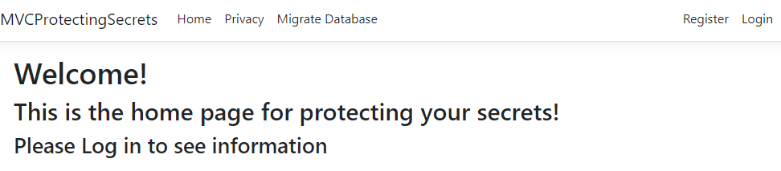
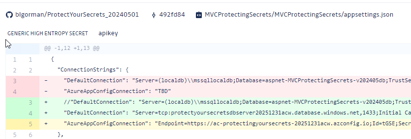

# Part 1 - All The Wrong things

After getting the resources deployed using the bicep templates, it's time to create the project with all the wrong things and the push it into Azure.

## Task 1 - Get the code

The starter and final versions of the code can be found in the `Resources` folder of this repository.

You can either fork this repository, or just download the repository as a zip file and extract it to a folder on your machine.  If you fork the repository, you will need to clone it to your machine.  If you download, you will need to create your own repo to push the code to at GitHub for publishing to Azure App Service.  

### Fork Option

1. [Fork the Repository](https://docs.github.com/en/get-started/quickstart/fork-a-repo)
1. [Clone the repository to your machine](https://docs.github.com/en/get-started/quickstart/fork-a-repo#cloning-your-forked-repository)

### Download Option

1. [Download the repository code](https://sites.northwestern.edu/researchcomputing/resources/downloading-from-github/)
1. [Create a new GitHub Repository](https://docs.github.com/en/get-started/quickstart/create-a-repo)  
1. [Push the starter code to the repository](https://gist.github.com/c0ldlimit/4089101) 

## Both Options

With your code in your repo, publish it to Azure App Service using the following learn documentation.

1. [Create CI/CD to publish to your Azure App Service](https://learn.microsoft.com/en-us/azure/app-service/deploy-local-git?tabs=cli)  

### Completion check

Before moving on, ensure that you have the following:
- A GitHub repository with the code
- A published Azure App Service that is displaying the website but you can't register or log in because no database information is configured.  Even if you could you have not configured the storage account information yet so that part would fail.

  
## Task 1 - Enable Repository Security tools

One of the most important things you can do to protect your secrets is to enable repository security tools.

Before creating problems, you should enable the tools to alert you to potential secret leaks.

>**Note:** For this walkthrough you will be using your OWN repository.  To simulate this, I've created a separate repository called 'blg_acw_protectingsecrets' and will be using that for the screenshots, so don't be confused by the different repository name.

### Step 1 - Turn on GitHub Security

Navigate to your repository in GitHub and click on the Security tab.

  

1. Turn on Dependabot alerts (optional - recommended for SPA frameworks)

Dependabot alerts will let you know if any of the packages you have in your project are out of date.  This is not as critical for an MVC site but is very important if you are using a SPA framework like React or Angular.

  


1. Get GitGuardian (free or premium versions available)++

Sign up for the free version of GitGuardian to see how to work with it in your repositories [Git Guardian](https://dashboard.gitguardian.com/auth/signup?utm_source=website&utm_medium=product&utm_campaign=gim_desc_page)  

Once you've signed up, you'll be able to see your violations on a dashboard at GitGuardian.  You will also receive email notifications when a violation is detected.


++For a team at work you will need to upgrade to a paid version.

1. Add the provider to your GitGuardian account (if it's not already integrated)

You will need to add the repository organization (i.e. GitHub -> yourusername) to allow it to be monitored.

Here you can see my personal GitHub is connected but options exist to add other providers like ADO, GitLab, GitHub Enterprise and BitBucket.

 

If you want to go deeper, you can also create custom integrations for notifications:

  

## Task 2 - Set the secrets locally

Since this is all the wrong things, you will start by putting the secrets directly in `appsettings.json`, then checking them in so they get committed to GitHub.  

You will need to set the following secrets in `appsettings.json`:

- Connection String for SQL Db
- Storage account Connection String (used to pull the images)
- ApplicationInsights Connection String (optional, will be used later, may as well get it now)

>**Note:** For brevity, this website doesn't use the storage account connection string and the SDK to get container images, but instead just uses a container SAS token (which expires and won't be valid by the time you're reading this if the account even still exists).  In other solutions you might encounter the SDK with the Storage Account Connection string instead of SAS tokens (especially for uploads).  The storage account connection string must be rotated to ensure that the secret is kept safe.  Either way, the connection string or SAS token should be protected, and the idea is the same in spirit - don't put your secret where it can be compromised.  

1. Set the Database Connection String

Find the database connection string in Azure under the `Connection Strings` navigation for the SQL Database.  Copy the connection string and paste it into the `appsettings.json` file.  Replace the `{your_password}` with the password you set when you deployed the database from the `iac` template.  

  

If you don't remember the password, use the portal to reset the password and get your updated password for the connection string.  For example:

```text
Server=tcp:protectyoursecretsdbserver20251231acw.database.windows.net,1433;Initial Catalog=ProtectYourSecretsDB;Persist Security Info=False;User ID=secretweb_user;Password=Azure#54321!;MultipleActiveResultSets=False;Encrypt=True;TrustServerCertificate=False;Connection Timeout=30;
```  

  

1. Create a SAS Token for the storage account and set it in `appsettings.json`

On the storage account page, go to the `images` container and create a SAS token with read permission (set expiration appropriately, default is 8 hours):

  

Create the token, then copy the SAS **token** (not the full url!!) and paste it into the `appsettings.json` file.  Replace the `ImagesSASToken` value with the SAS token you just created.

  

>**Important:** You must also update the name of your storage account to the correct name of your storage account generated during the deployment.  If you fail to do this you will not get the images from the storage account container correctly.

1. Optional but recommended - Get the full connection string for the App Configuration and put it into `appsettings.json`.

>**Note:** this will not be used until later in the walkthrough, but if you get it now you can move it along with other secrets and be ready to use it when required.

   

Your connection string should be something like (with a different secret key of course):

```text
Endpoint=https://ac-protectingyoursecrets-20251231acw.azconfig.io;Id=co+R;Secret=4IDve......lHM=
```

Place the connection string in the `appsettings.json` file.  Replace the `{your_connection_string}` with the connection string you just created.

1. Optionally you can get the connection string for the application insights and put it into the `appsettings.json` file.  Ideally, you would use a different application insights instance for each environment, but for this walkthrough you will use the same one for all environments.  

>**Note:** You do not need to do this, it's completely optional.  Also note that this information is ALREADY stored in the Azure App Service if you allowed monitoring during deployment (the IAC did this for you if you ran the template).  Truly, this step is just to hook up the local environment to application insights so you can see the telemetry in the portal.

  

Get the connection string and then put it into `appsettings.json` if you so desire.

  

## Task 3 - Push the changes to Github

To make this all the wrong things, you will need to push the changes to GitHub so that the secrets are stored in the repository.

While this **should** allow the app to work you will now have exposed your secrets in the repo.  This is a bad thing because any code in GitHub should be considered compromised.  If you have a public repo, this is even worse because anyone can immediately see your secrets, as well as fork/clone your code and have them permanently.  They can then look at your other repositories and if you have done this in multiple places they can find your patterns, such as using the `Azure#54321!` password for all of your test databases.

1. Commit the changes to GitHub

Commit and push to GitHub.  Wait for the app service to deploy.

  

1. While the website deploys, review your GitGuardian website.

GitGuardian has already detected that I published some secrets. 

  

Additionally, I've been emailed about the egregious error on my part:

  

1. Check the website

With the website deployed, navigate to the public URL for the website and attempt to Register.


>**Note:** do not close the page, you will need it again in a moment.  If you did close it, you can just redo the registration once the migrations are applied.

There is a bit of a chicken/egg scenario here, with the migrations endpoint requiring auth and the inability to register until you have migrations run.

You could put the code in the startup to run migrations, or you can add your local IP to the server firewall and run migrations from your machine.

1. Check the database firewall

It's always a good idea to make sure the services can communicate.  On the server firewall (Networking) make sure to enable `Selected Networks` then check the box for the `Allow Azure services and resources to access this server` option.  Additionally, add your local IP to the firewall so you can run the migrations from your dev machine (Clearly this is **not** a production solution for migrations).

  

1. Return to the code and run the migrations.

Open the Package Manager Console and run the migrations with the command:

```PowerShell
update-database
```  

Make sure the update is successful, then return to the portal and attempt to register the user again (if you still have it open, just hit f5 on the page with the error).

Confirm the email or you won't be able to log in:

  

Hit the `X` on the `Thank you for Confirming` page.

1. Log in as the user.

You will now see the images as expected. Additionally, you will be able to run migrations from the URL if you wanted going forward with any logged in user.

  


