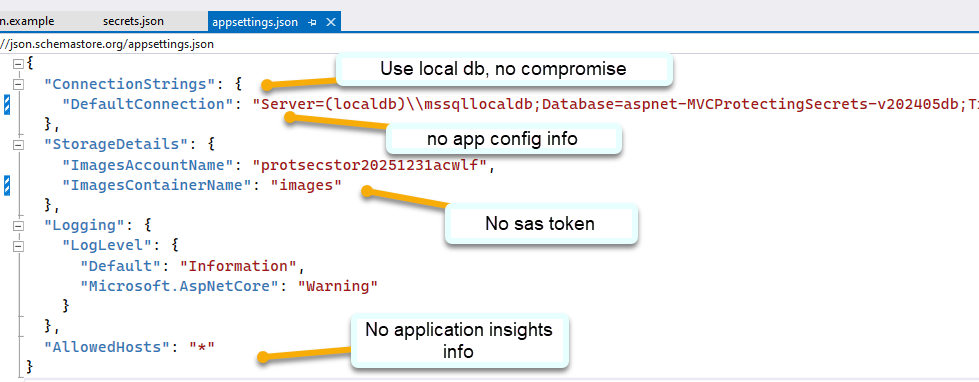
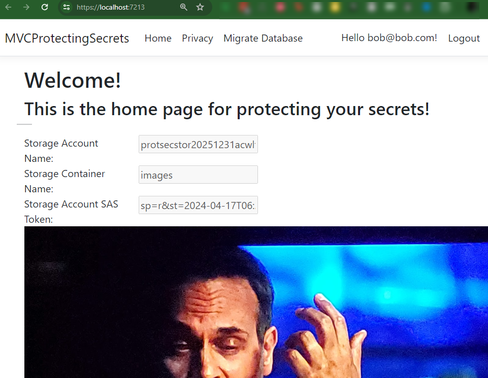
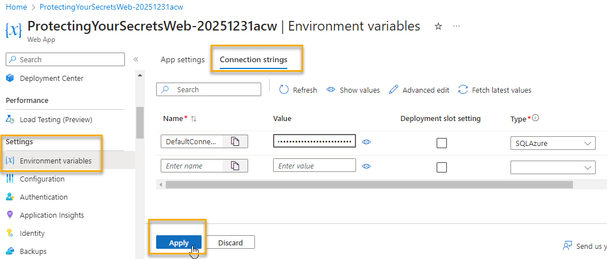
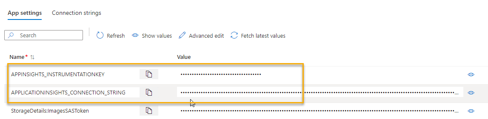
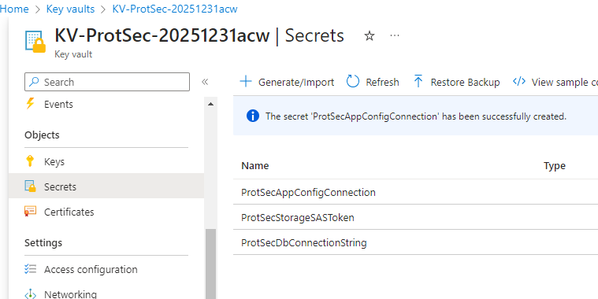
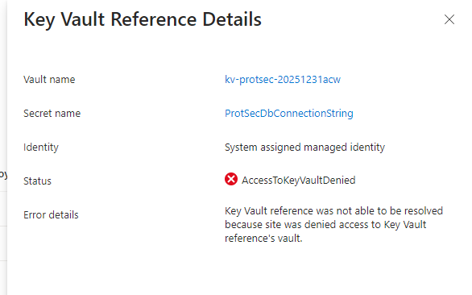

# Part 2 - Securing Secrets

Before starting this part, ensure that you have completed [Part 1 - All the wrong things](Part1-AllTheWrongThings.md), and that you have (or had prior to rotation of keys) a working website that integrates secrets for the database connection string and the storage account SAS token.

## Task 1 - Move all of the secrets out of `appsettings.json` into local user secrets `secrets.json`

To get started, the first tool you want to leverage is the `local user secrets` option available in Visual Studio.  This will allow you to store secrets in a local file that is not checked into source control, and is only available on your local machine.  

This is a great option for keeping secrets out of your source control and allowing developers to connect to resources.  

It is still not ideal to have secrets at all, so we'll get to that by the end of this workshop.

Additionally, this is not a feasible option for a development team, as every developer has to have their own copy of `secrets.json` on their machine. 

For an entire team, you will likely prefer to create a shared vault at minimum with developer secrets, and just point to that vault for any secrets that are needed rather than try to have every developer set up local secrets.  

1. Right-click and select `Manage User Secrets`

  

>**Note:** Alternatively you can add/work with user secrets via the `dotnet` cli:

[Add User Secrets via CLI](https://learn.microsoft.com/aspnet/core/security/app-secrets?view=aspnetcore-8.0&tabs=windows&WT.mc_id=AZ-MVP-5004334#use-the-cli)  

1. Use the sample file included to copy and paste the key-value pairs into the `secrets.json` file.  

This will ensure that you have the correct keys and then you can just update values from the `appsettings.json` file. 

  

1. Update the values for the Azure App Configuration connection and the SAS token (generate/get new values if needed).

>**NOTE:** There is no need to store the connection string for the azure database in your local machine, so just remove references to it altogether.  The connection string will be updated at Azure in a later step.

  

1. With the secrets set in the `secrets.json` file, remove the sensitive information from `appsettings.json` and save the file.

  

>**Note**: You could move the app settings for the storage details into secrets if desired (account name and container name).  If you do move any other values, you would need to add configuration values at Azure in the next steps to map to every key-value pair in the `secrets.json` file since these will NOT get pushed into azure directly.

1. Run the app locally and make sure the app runs locally (using your local database but Azure storage via the SAS token).

Ensure that your application still runs (you may need to run migrations locally if you didn't already do that - and register a user).  Once you are certain the changes work locally, push to GitHub.

  

>**Note:** you should not have to make any code changes for this to work, just move the secrets to the new file.

  

This push will re-deploy the application, and now it won't work (even if you didn't rotate keys).  Why do you think that is?

Correct Answer:  
The database connection string and the SAS token are no longer in the local deployment at Azure.

## Completion Check

At the end of this first task, you should have removed all of the secrets from your local `appsettings.json` file and moved them to the `secrets.json` file.  You should also have a working website locally that is using the `secrets.json` file.

The website is no longer working at Azure and will be fixed in the next task.

## Task 2 - Put the raw secrets in Azure App Service Configuration

To get the site working, we need to put the database connection string and SAS token into the Environment and Configuration variables in the Azure App Service.

1. Add the database connection string.

In the app service, under `Environment Variables` then under `Connection Strings` add the connection string for the database.

>**Note:** if your azure version is older or not yet updated, you may see all of the settings on the `Configuration` tab.  This is fine, just add the connection string there under the connection strings section.

- Name: `DefaultConnection`
- Value: `your-connection-string`
- Type: `SQLAzure`
- Deployment Slot Setting: Checked or Unchecked (your choice), it doesn't matter for this walkthrough since we aren't using deployment slots.

  

>**Note:** make sure to save everything, which is a double `OK` process.   
1) Hit Apply 
2) Hit Confirm 

1. Add the App Configuration Connection String

Since you're here already, just add the connection string for the App Configuration.  This is not yet in use but it's great to just get it in here for now.  This will be needed in part 3.

- Name: `AzureAppConfigConnection`
- Value: `your-connection-string`
- Type: `Custom`
- Deployment Slot Setting: Checked or Unchecked (your choice), it doesn't matter for this walkthrough since we aren't using deployment slots.

 

1. Add the SAS token value for the storage account in the `Environment Variables` -> `App Settings`.

 - Name: `StorageDetails:ImagesSASToken`
 - Value: `your-sas-token`

  

1. Notice the Application Insights

Make a note that the Application Insights settings are already in place.

  

1. Test the website

With the configuration settings and database connection in place, the website should once again be working

## Completion Check

At the end of this part, you should have no secrets in your GitHub repository and the website should be working based on the use of `secrets.json` on the local machine and the configuration settings in the Azure App Service.

## Task 3- Move the secrets to Azure Key Vault

Now that the secrets are mitigated from code, it's time to hide them from people who don't need to see them.

To securely store your secrets, you'll need to complete a couple of tasks.  First you will put the secrets into KeyVault.  Then you will change the settings to leverage KeyVault for secrets, and finally you will create a managed identity for the app and authorize that identity in the Azure Key Vault Policy.

Before starting I want to call out that this is *NOT* the only way to work with Azure Key vault.  In fact, you can leverage Key Vault directly from your code.  This is just one way to work with Key Vault and secrets in Azure. There could be side effects for both approaches, so be sure to understand the implications of each.  Using secrets directly could slow you down and cache results on startup which limits rotation ability.  Using from code requires more than just `Get` permissions (also requires `List` which means your secrets could be exposed if you don't have proper controls in place).

1. Move the secrets to Azure Key vault.

To get started, open your Key Vault and add two secrets.  The `name` of the secret doesn't matter if you aren't directly leveraging it in code, but the name will be part of the URI so you will want to keep it short and meaningful.

  

>**Note:** You can leverage secrets directly from code. This walkthrough will not take that approach however.  If you are interested in retrieving secrets via code, you can review [this learn tutorial](https://learn.microsoft.com/en-us/azure/key-vault/general/tutorial-net-create-vault-azure-web-app?WT.mc_id=AZ-MVP-5004334).  

If you currently see a note that says you are `unauthorized` and `the operation "List" is not enabled...` then you need to add your identity to the KeyVault policies.

  

Click on `Access Policies` and then `Create`.  


Select all the permissions for Keys, Secrets, and Certificates, then hit `Next`.


Select your principal identity and hit `Next`:


Hit `Next` to skip the `Application (optional)` tab.

Click `Create` on the `Review + Create` tab to save the policy.


For simplicity, name the first secret something like

```text
ProtSecDbConnectionString
```  

Set the value to the connection string for the database.

Optionally, you can set the content type to `string` and you can alter the active dates or even set the secret to `disabled`.  You can also add metadata tags if you wish.

  

Repeat the process for the storage account SAS token and the App Configuration connection string.

```text
ProtSecStorageSASToken
```  

```text
ProtSecAppConfigConnection
```

  

1. Get the secret URIs for the secrets you just created.  

For all three secrets, check the value by drilling into them and hitting the `Show Secret Value` button.

  

While on each secret, copy the `Secret Identifier` URI.  You will need this in the next step for all three secrets. So keep them handy in a notepad.

The values should look similar to the following:

```text
https://kv-protsec-20251231acw.vault.azure.net/secrets/ProtSecStorageSASToken/7f6e8703a0504f0889e04545a73c7ab1

https://kv-protsec-20251231acw.vault.azure.net/secrets/ProtSecDbConnectionString/03df3ab51a5f44168f95276f9e8efadb

https://kv-protsec-20251231acw.vault.azure.net/secrets/ProtSecAppConfigConnection/db08bfe973424787b32862c204bf715e
```  

Remove the version number from the end so that all you get is the raw URL to the name of the secret.  By removing the version number, you'll always get the latest version of the secret:

```text
https://kv-protsec-20251231acw.vault.azure.net/secrets/ProtSecStorageSASToken

https://kv-protsec-20251231acw.vault.azure.net/secrets/ProtSecDbConnectionString

https://kv-protsec-20251231acw.vault.azure.net/secrets/ProtSecAppConfigConnection
```

1. Update the configuration settings in the Azure App Service.

Now that the secrets are in Key Vault, you can update the configuration settings in the Azure App Service to leverage the secrets from Key Vault.  

To do this, you will need to update the configuration settings to use the `@Microsoft.KeyVault(SecretUri=...)` syntax to wrap the URI to the secret in Key Vault.

The values should look similar to the following:

```text
@Microsoft.KeyVault(SecretUri=https://kv-protsec-20251231acw.vault.azure.net/secrets/ProtSecStorageSASToken)
``` 
  

And

```text
@Microsoft.KeyVault(SecretUri=https://kv-protsec-20251231acw.vault.azure.net/secrets/ProtSecDbConnectionString)
```  

And

```text
@Microsoft.KeyVault(SecretUri=https://kv-protsec-20251231acw.vault.azure.net/secrets/ProtSecAppConfigConnection)
```  

  

Once you have updated both, you'll get a notification that they are `Key Vault References` and you will see that they are not working.

  

The reason they are not working is because the application is not authorized to read from Key Vault.

  

### Task 4 - Authorize the App Service to read from Key Vault  

In order to read from key vault, the app service needs permission.

1. Create a Managed Identity for the App Service  

Click on the `Identity` tab on the left navigation of the App Service.  When the window comes up, give the app service a system managed identity (or validate that one is already assigned).

>**Note:** The iac for the app service assigns a system managed identity for you.


Copy the `Object (principal) ID` or just have the name of the app service handy. You will use this to authorize the app service to read from Key Vault.

1. Return to the Key Vault and add permission to `Get` secrets from the Key Vault.

Under `Access Policies` click `Create` and then select `Get` under  `Secret Permissions` from the dropdown.  You do not need to select any other permissions (and you don't want to).  Thinking least privilege, you don't want the app to be able to iterate all the secrets and get them all, so the only thing it can do is get the secrets which is specifically knows about.

  

Hit `Next`

1. Paste the object principal ID into the `Search` box and select the app service principal.

  

Hit `Next`.

The `Application (optional)` will say that an application is already selected, so hit `Next` 

  

On the `Review + Create` page, hit `Create` to save the policy.

  

Ensure your application is listed with `Get` Secret permissions.

  

1. Restart the web application to allow it to fetch the settings from Key Vault.

  

>**Note:** it may take up to five to ten minutes for the application to register that it has permissions for the secrets, if it's not working, get a cup of coffee and restart again. This is where direct code might be a better solution since it would work almost immediately.  

>**Note:** you may just do a hard `stop` of the web app and start it again to make sure that all caches are cleared.

  

1. With the application showing that it has permission, view the website and validate that the secrets retrieved from Key Vault are working as expected.

## Completion Check

You've reached the end of part 2.  In this section you learned how to remove secrets from app settings into your local user secrets, and then you saw how to put the secrets into the app configuration settings at Azure.  From there, you moved the secrets into Azure Key Vault and no longer have any direct secret information in the app service or your application code that is checked into GitHub.

With this, you've now made it possible for secret values like connection strings to be completely unknown to anyone but Key Vault admins for your production and development apps at Azure.

In the next part you will move to using shared secrets in Azure App Configuration.
