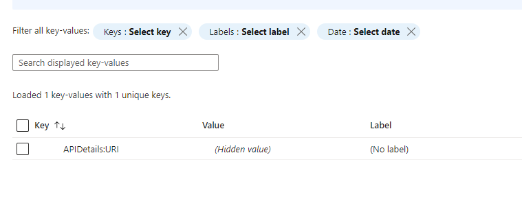
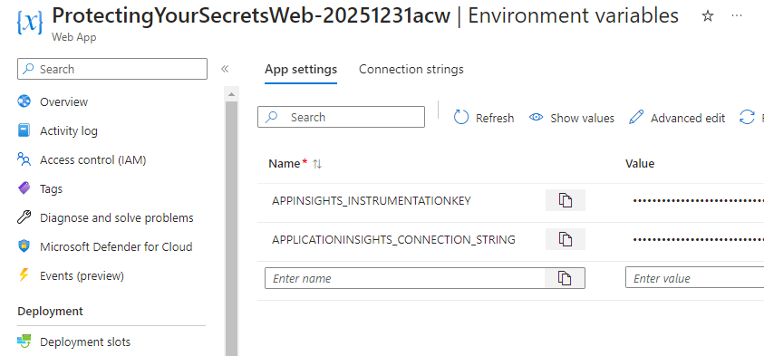

# Part 3 - Azure App Configuration

Before starting this part, ensure that you have completed [Part 1 - All the wrong things](Part1-AllTheWrongThings.md) and [Part 2 - Securing Secrets](Part2-SecuringSecrets.md), and that you have a working website that integrates secrets for the database connection string and the storage account SAS token that are leveraged from Key vault in the App Service configuration settings.

## Task 1 - Add Secrets to Azure App Configuration

Azure App configuration has two types of key-value pairs that you can use.  The first type is a shared text configuration value.  The second type is a KeyVault Reference value.  

For example, you could put the name of the storage account and the container as a shared plain text value which could be leveraged from any application.  However, the database connection and the SAS token need to be secured, so you would use a KeyVault Reference value for those.

In order to demonstrate both, we can add a shared plain text value and a KeyVault Reference value to the App Configuration.

These changes will require some code changes as well, so there will be a couple of moments to get some more coffee.  

A really good thought here is something like a shared API key for a service that is used across multiple applications.  This way, if the key changes, you only need to update it in one place.  The root URI for the API could be a shared, plain text value, and the API key itself could be a KeyVault Reference.

1. Navigate to the App Configuration created at the start of the walkthrough.  You can find it by searching for `AC-ProtectingYourSecrets` in the Azure portal.

    Open the `Configuration Explorer` then select `Create` -> `Key value` to add a new key-value pair that is NOT a Key Vault reference.  

      

    Add the following key-value pair:
    - Key: `APIDetails:URI`
    - Value: `https://somefunctionapp.azurewebsites.net/itsnotreal/example?code=notarealsiteatall`
    - Label: [leave blank]
    - Content Type: [leave blank]

    Hit `Apply` to save the new key-value pair.  

      

1. Add the database connection string and the storage account SAS token as Key Vault references.  

    Select `Create` -> `Key Vault Reference` to add a new key-value pair that is a Key Vault reference.  

    Add the following key-value pair, using the browse option to select the appropriate secret from your Key Vault:

    - Key: `ConnectionStrings:DefaultConnection`
    - Label: [leave blank]
    - Browse:
        - Subscription: [your subscription]
        - Resource Group: [your rg]
        - Key Vault: [your vault]
        - Secret: [your connection string secret]

      

1. Repeat the process for the storage account SAS token, using the following values:

    - Key: `StorageDetails:ImagesSASToken`
    - Label: [leave blank]
    - Browse:
        - Subscription: [your subscription]
        - Resource Group: [your rg]
        - Key Vault: [your vault]
        - Secret: [your sas token secret]

      

You have now set the app configuration to read from key vault and share both common and protected shared values across multiple applications.  The next step is to authorize the App Configuration to access the Key Vault.  

## Task 2 - Authorize App Configuration to Access Key Vault

The App configuration will also need to be authorized to connect and get Key vault Secrets.  This is done by adding an access policy to the Key Vault and a managed identity to the App Configuration.

This is the same process as was done for the App Service in the previous part (part 2).  Repeat that process to add the App Configuration as a Key Vault access policy.

1. Add a system managed identity to the App Configuration and get the Object Principal ID

  

1. Add an access policy to the Key Vault for the App Configuration with `Get` Secrets permissions.

  

## Task 3 - Authorize the app service to read from the app configuration  

The app service must have App Configuration Data Reader permissions to read from the App Configuration.  This is done by adding a role assignment to the App Configuration for the App Service.  

>**Note**: You must be `owner` or `user access administrator` on the resource group or subscription to complete this task.

1. To allow the app service to read from the app configuration, the app service identity must be authorized.

Get the name for the App Service. For the role assignment, the Object (Principal) ID will not locate the correct resource, so you will need to use the name of the App Service.

Navigate to the `Access Control (IAM)` section on the App Configuration and add a new role assignment:

  

Set the new role assignment with the following values:

- Role: Select `App Configuration Data Reader` and hit `Next`  

      

- Select `Managed Identity` for the Assign Access to.  

- Members: hit the `+ Select Members` button, then browse to get the app service:

      

- Review + Assign: Make sure things look correct, then hit `Review + Assign`

    

1. Validate the role is saved as expected.

    

## Task 3 - Update the App Service to use the shared values

With the app configuration in place, access to Key Vault from the app service ready to go, and the App Configuration Data Reader role assigned for the App Service, it's time to update the App Service to use the shared values.  

1. Remove the existing values for the database connection string and the SAS token from the App Service configuration settings.

    >**NOTE:** Do not remove the app configuration connection string or you won't be able to connect and get the values.

    First, you will need to delete the existing connections, which will break the website.  This will show that the connections are no longer working before getting them back through the shared app configuration.

      

    Both the database connection string and the sas token should be removed from the App Service configuration settings.

      

## Task 4 - Update the code to leverage the shared values

For this next part, the code needs to be updated in the Application to work against the Azure App Configuration.

1. Open the project and go to the `program.cs` file. 

    Find the `//TODO: Add the Azure App Configuration code here.` comment and add the following code:

    ```csharp  
    var appConfigConnection = builder.Configuration.GetConnectionString("AzureAppConfigConnection");

    builder.Host.ConfigureAppConfiguration((hostingContext, config) =>
    {
        config.AddAzureAppConfiguration(options =>
        {
            options.Connect(appConfigConnection);
            options.ConfigureKeyVault(options =>
            {
                options.SetCredential(new DefaultAzureCredential());
            });
        });
    });
    ```

>**Note:** because the app configuration is now leveraging Key Vault, the configuration must configure Key Vault to use whatever the default credential is.  In this case, it is the managed identity of the App Service at Azure or your default credential if local.  

If you didn't want to do key vault right away, you would need to remove the key vault references from the app configuration and just use the app configuration connection string without configuration.  This would allow you to use the app configuration without key vault.

1. After updating the code, run it locally and validate that the website is working as expected.

    It is important to note that this code change requires your personal developer credential to have access to app config and azure key vault.  If you are the owner or contributor on the subscription you should be ok.  If not, you should add your permissions to "Get" secrets in the key vault and also be a data reader in the app config.

1. Push the changes to GitHub and let the application publish via CI/CD.

    Provided everything was completed successfully, the application should be restored to working order.

      

## Completion Check

In this walkthrough, the application was set to leverage settings from a shared app configuration.  Not only are the secrets secured in Key Vault, but they are also now potentially shared across multiple applications.  This is great for things like a shared database connection, storage connections, and/or API keys, while also giving you the flexibility to create additional app configurations for developers that use shared development resources instead of production resources.

With this walkthrough completed, there are no longer any references to the database connection string or SAS token in the application settings at Azure, and all of the connection values are leveraged via code connections to the App Configuration, which then retrieves the values from Key Vault.
