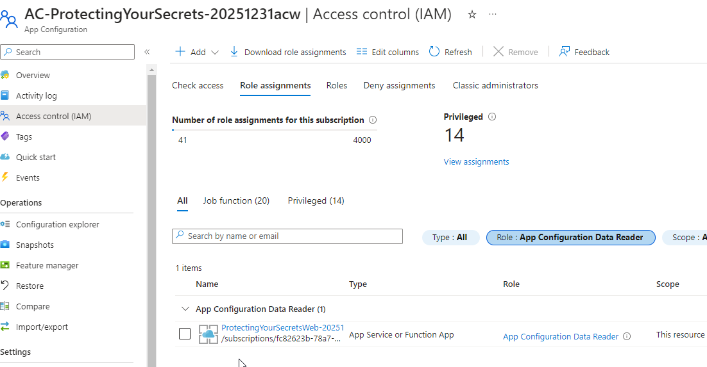
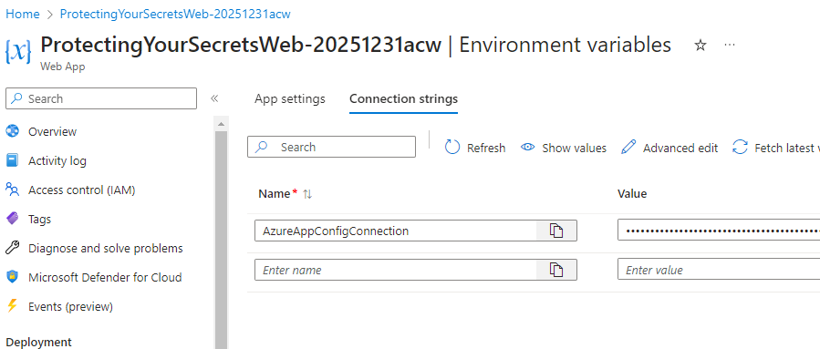

# Part 3 - Azure App Configuration

Before starting this part, ensure that you have completed [Part 1 - All the wrong things](Part1-AllTheWrongThings.md) and [Part 2 - Securing Secrets](Part2-SecuringSecrets.md), and that you have a working website that integrates secrets for the database connection string and the storage account SAS token that are leveraged from Key vault in the App Service configuration settings.

## Task 1 - Add Secrets to Azure App Configuration

Azure App configuration has two types of key-value pairs that you can use.  The first type is a shared text configuration value.  The second type is a KeyVault Reference value.  

For example, you could put the name of the storage account and the container as a shared plain text value which could be leveraged from any application.  However, the database connection and the SAS token need to be secured, so you would use a KeyVault Reference value for those.

For brevity, this walkthrough will only address the KeyVault Reference values, but a shared text value would be added in the same way.

1. Navigate to the App Configuration created at the start of the walkthrough.  You can find it by searching for `AC-ProtectingYourSecrets` in the Azure portal.

    Open the `Configuration Explorer` then select `Create` -> `Key value` to add a new key-value pair that is NOT a Key Vault reference.  

      

    Add the following key-value pair, using the browse option to select the appropriate secret from your Key Vault:

    - Key: `ConnectionStrings:DefaultConnection`
    - Label: [leave blank]
    - Browse:
        - Subscription: [your subscription]
        - Resource Group: [your rg]
        - Key Vault: [your vault]
        - Secret: [your connection string secret]

      

1. Repeat the process for the storage account SAS token, using the following values:

    - Key: `StorageDetails:ImagesSASToken`
    - Label: [leave blank]
    - Browse:
        - Subscription: [your subscription]
        - Resource Group: [your rg]
        - Key Vault: [your vault]
        - Secret: [your sas token secret]

      

## Task 2 - Authorize App Configuration to Access Key Vault and authorize App Service to access App Configuration as a config data reader.

The App configuration will also need to be authorized to connect and get Key vault Secrets.  This is done by adding an access policy to the Key Vault and a managed identity to the App Configuration.

This is the same process as was done for the App Service in the previous part (part 2).  Repeat that process to 

1. Add a system managed identity to the App Configuration and get the Object Principal ID

  

1. Add an access policy to the Key Vault for the App Configuration with `Get` Secrets permissions.

  

1. To allow the app service to read from the app configuration, the app service identity must be authorized.

Get the name for the App Service. For the role assignment, the Object (Principal) ID will not locate the correct resource, so you will need to use the name of the App Service.

Navigate to the `Access Control (IAM)` section on the App Configuration and add a new role assignment:

  

Set the new role assignment with the following values:

- Role: Select `App Configuration Data Reader` and hit `Next`  

      

- Members: hit the `+ Select Members` button, then paste the name of the App Service and select it, then hit `Select`

      

- Review + Assign: Make sure things look correct, then hit `Review + Assign`

    

1. Validate the role is saved as expected.

    

## Task 3 - Update the App Service to use the shared values

With the app configuration in place, access to Key Vault from the app service ready to go, and the App Configuration Data Reader role assigned for the App Service, it's time to update the App Service to use the shared values.  

1. Remove the existing values for the database connection string and the SAS token from the App Service configuration settings.

    First, you will need to delete the existing connections, which will break the website.  This will show that the connections are no longer working before getting them back through the shared app configuration.

    >**Note:** In this walkthrough, both settings are going through the App Configuration.  You are easily able to mix and match.  For example, if you just want to move the SAS token or the Connection String, you could do that, and just leave the other value set directly to the Key Vault reference. 

      

1. Update the `AzureAppConfigConnection` value.

    As strange as it may seem, the connection string value will not be used from the app service.  Instead, all that is needed is the URI for the Azure App Configuration.  This is because the app service will use the managed identity to access the App Configuration, and the App Configuration will use the managed identity to access the Key Vault.

    The URI for the endpoint of the app configuration can be found on the overview page of the App Configuration:

      

    The value should be similar to:

    ```text
    https://ac-protectingyoursecrets-20251231acw.azconfig.io
    ```  

    Copy the URL and paste it for the value of the `AzureAppConfigConnection` setting in the App Service configuration settings.

      

    >**Note:** the application will still currently be broken as a code update is needed to leverage the App Configuration values.  This will be done in the next task.

## Task 4 - Update the code to leverage the shared values

For this next part, the code needs to be updated in the Application to work against the Azure App Configuration.

1. Open the `project.cs` file and add the following code.

    ```csharp  
    builder.Host.ConfigureAppConfiguration((hostingContext, config) =>
    {
        var settings = config.Build();

        ////by default, use the default credential:
        TokenCredential credential = new DefaultAzureCredential();
        var env = settings["Application:Environment"];

        //without keyvault:
        if (env == null || !env.Trim().Equals("develop", StringComparison.OrdinalIgnoreCase))
        {
            //if at azure, use ManagedIdentityCredential and AppConfiguration URI endpoint
            credential = new ManagedIdentityCredential();

            config.AddAzureAppConfiguration(options =>
                options.Connect(new Uri(settings["AzureAppConfigConnection"]), credential)
                    .ConfigureKeyVault(kv => { kv.SetCredential(credential); }));
        }
        else
        {
            //from local app, use connection string
            config.AddAzureAppConfiguration(options =>
                    options.Connect(settings["AzureAppConfigConnection"])
                            .ConfigureKeyVault(kv => { kv.SetCredential(credential); }));
        }
    });
    ```

    Notice that this code uses the managed identity from the App Service to access the App Configuration, and uses the connection string directly for local development (so you could point to a second shared app config instead of the production version to easily separate concerns).  

1. After updating the code, run it locally and validate that the website is working as expected.

    It is important to note that this code change requires your personal developer credential to have access to app config and azure key vault.  If you are the owner or contributor on the subscription you should be ok.  If not, you should add your permissions to "Get" secrets in the key vault and also be a data reader in the app config.

    >**Important:** It is important to note that once you make this change your local instance will also be connected to the KeyVault database by the connection string as these settings will override even your local secrets (debug the app to see the values for the connection string).  This is why it is important to have a separate app config for local development.

    To prove this out, you could now remove the connection string and sas token from your local secrets and the app will still work.

      

1. Push the changes to GitHub and let the application publish via CI/CD.

    Provided everything was completed successfully, the application should be restored to working order.

      

## Completion Check

In this walkthrough, the application was set to leverage settings from a shared app configuration.  Not only are the secrets secured in Key Vault, but they are also now potentially shared across multiple applications.  This is great for things like a shared database connection, storage connections, and/or API keys, while also giving you the flexibility to create additional app configurations for developers that use shared development resources instead of production resources.

With this walkthrough completed, there are no longer any references to the database connection string or SAS token in the application settings at Azure, and all of the connection values are leveraged via code connections to the App Configuration, which then retrieves the values from Key Vault.
