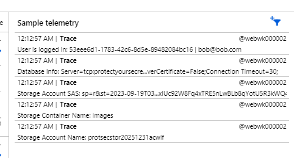
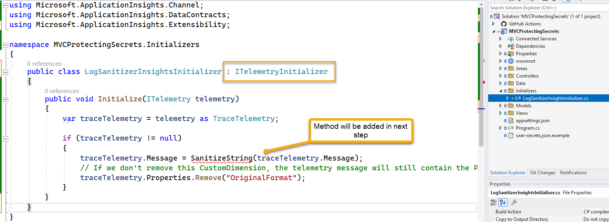
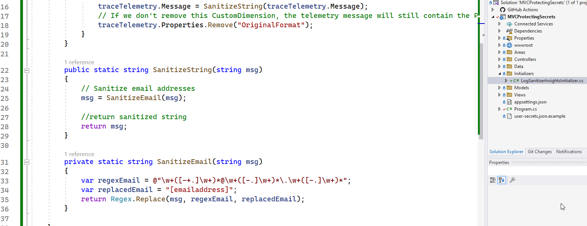
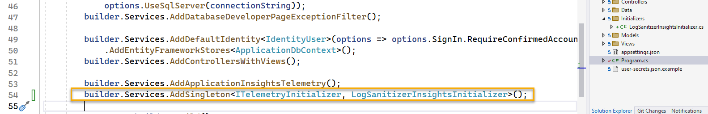
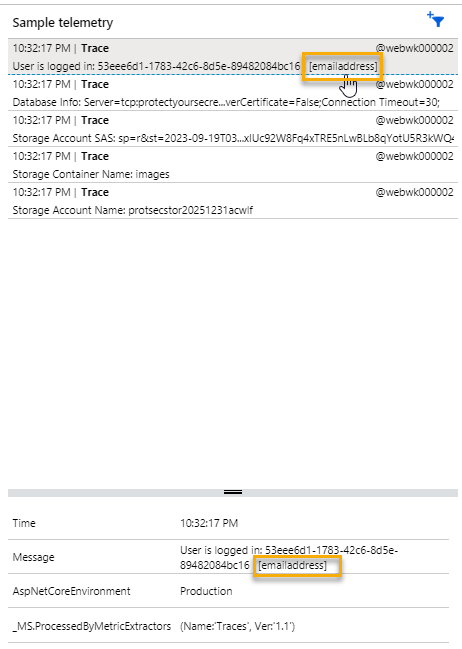
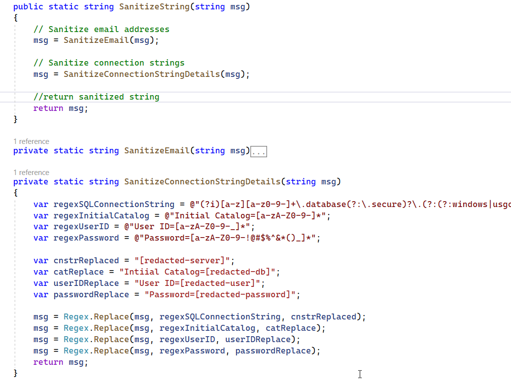
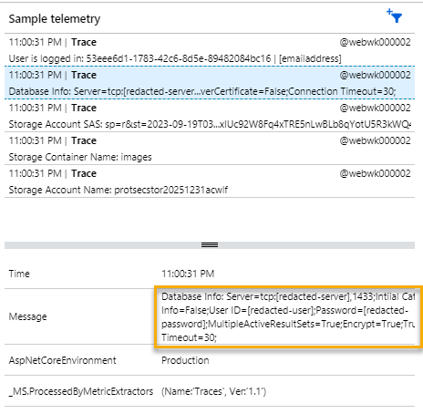
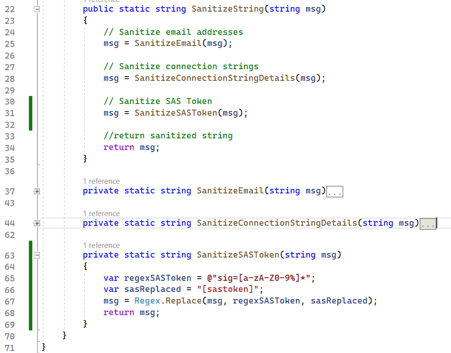
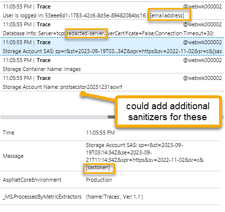

# Part 4 - Sanitize your Logs

Before starting this part, ensure that you have completed [Part 1 - All the wrong things](Part1-AllTheWrongThings.md) and [Part 2 - Securing Secrets](Part2-SecuringSecrets.md), [Part 3 - Azure App Configuration](Part3-AzureAppConfiguration.md) and that you have a working website that integrates secrets for the database connection string and the storage account SAS token that are leveraged from Key vault via the shared Azure App Configuration.

One last important piece to creating a secure solution is to also ensure you aren't logging things like secrets and personally identifiable information (PII). This is a simple process, but one that is often overlooked.  This step will show you how to build a sanitizer extension to ensure that your logs do not contain unwanted values.

>**Note**: this part of the walkthrough relies on information outlined [in this blog post by Tobias Zimmergren from April 2023](https://zimmergren.net/redacting-sensitive-information-application-insights/)  

## Task 1 - Review the logs

Before sanitizing the logs, let's review the logs to see what is currently being logged.  To do this, you will just want to review the logs being written to the `Application Insights` instance.  The code is already set to log information that should have been protected.  

1. Navigate to the live metrics for the app and hit the home page as a logged in user.

  

Note that current logs contain PII for the user (id and email), the full connection string for the database, the storage account sas token, and other important information that should be sanitized.

### Step 1 - Create a sanitizer telemetry initializer

For this first step, you will create code to act as a sanitizer when logs are written to `Application Insights`.  This will ensure that the logs do not contain any secrets or PII by using regular expressions to replace the values with sanitized values.

For example, the current logs contain PII such as the `email` for `bob@bob.com`.  For this sanitizer to work, a regular expression will replace the email with something like "[emailaddress]".  Clearly, you can choose how much of the email to replace, but the goal is to ensure that the full email is not exposed in the logs.


1. Create the `LogSanitizerInsightsInitializer` class

    Navigate to the `ProtectingYourSecrets` project and create a new folder called `Initializers`.

    Add a class to the folder called `LogSanitizerInsightsInitializer` and add the following code:

    ```csharp
    public void Initialize(ITelemetry telemetry)
    {
        var traceTelemetry = telemetry as TraceTelemetry;

        if (traceTelemetry != null)
        {
            traceTelemetry.Message = SanitizeString(traceTelemetry.Message);
            // If we don't remove this CustomDimension, the telemetry message will still contain the PII in the "OriginalFormat" property.
            traceTelemetry.Properties.Remove("OriginalFormat");
        }
    }
    ```  
    Add the following implements statement to the class definition:

    ```csharp
    public class LogSanitizerInsightsInitializer : ITelemetryInitializer
    ```  
    and the using statement:

    ```csharp
    using Microsoft.ApplicationInsights.Extensibility;
    ```  

      

    The code sets up the telemetry object to be sanitized by calling the `SanitizeString` method.  It also removes the `OriginalFormat` property from the telemetry object so the PII is not exposed in the logs.  The code also sets the `LogSanitizerInsightsInitializer` class to implement the `ITelemetryInitializer` interface.

1. Add the `SanitizeString` method to the class

    In the `LogSanitizerInsightsInitializer` class, add the following method with the code to sanitize emails, along with the first helper method to sanitize emails from the logs:

    ```csharp
    public static string SanitizeString(string msg)
    {
        // Sanitize email addresses
        msg = SanitizeEmail(msg);

        //return sanitized string
        return msg;
    }

    private static string SanitizeEmail(string msg)
    {
        var regexEmail = @"\w+([-+.]\w+)*@\w+([-.]\w+)*\.\w+([-.]\w+)*";
        var replacedEmail = "[emailaddress]";
        return Regex.Replace(msg, regexEmail, replacedEmail);
    }
    ```  

      

1. Inject the telemetry sanitizer initializer into the `Program.cs` file.

    In the `Program.cs` file, add the following line of code after the `builder.Services.AddApplicationInsightsTelemetry();` line:

    ```csharp
    builder.Services.AddSingleton<ITelemetryInitializer, LogSanitizerInsightsInitializer>();
    ```  

      

    >**Important**: If you get an error that the type can't be used because there is no implicit reference conversion to type ITelemetryInitializer it means you forgot to implement the ITelemetryInitializer interface on the `LogSanitizerInsightsInitializer` class.  

1. Make sure the project builds and publish it.

    Check in the changes and push to GitHub to publish the project.

    Run the project and review the logs in Application Insights to see the sanitized email:

      

## Add additional sanitizers to the code

To complete your sanitizer, add methods to sanitize things like the connection string, the identity user id, and the storage account SAS token.

1. Sanitize the connection string from the logs:

    There are a number of ways you could do this. I found a regex here that seems to be promising:  [Secret Scanning no longer supported in GitHub private repos](https://github.blog/changelog/2021-10-18-secret-scanning-no-longer-supports-azure-sql-connection-strings-in-private-repos/).  The regex is as follows:

    ```regex
    (?i)[a-z][a-z0-9-]+\.database(?:\.secure)?\.(?:(?:windows|usgovcloudapi)\.net|chinacloudapi\.cn|cloudapi\.de)
    ```  
    
    This works great for the database server, but you will likely want to do more (optionally), such as the database name, username, and password, or maybe all you want to do is the password. You can decide what works best for your solution.

    Add the following method call to the `LogSanitizerInsightsInitializer` class `SanitizeString` method following the call to `SanitizeEmail`:

    ```csharp
    // Sanitize connection strings
    msg = SanitizeConnectionStringDetails(msg);
    ```

    Then add the following method after the `SanitizeEmail` method:

    ```csharp
    private static string SanitizeConnectionStringDetails(string msg)
    {
        var regexSQLConnectionString = @"(?i)[a-z][a-z0-9-]+\.database(?:\.secure)?\.(?:(?:windows|usgovcloudapi)\.net|chinacloudapi\.cn|cloudapi\.de)";
        var regexInitialCatalog = @"Initial Catalog=[a-zA-Z0-9-]*";
        var regexUserID = @"User ID=[a-zA-Z0-9-_]*";
        var regexPassword = @"Password=[a-zA-Z0-9-!@#$%^&*()_]*";

        var cnstrReplaced = "[redacted-server]";
        var catReplace = "Intiial Catalog=[redacted-db]";
        var userIDReplace = "User ID=[redacted-user]";
        var passwordReplace = "Password=[redacted-password]";

        msg = Regex.Replace(msg, regexSQLConnectionString, cnstrReplaced);
        msg = Regex.Replace(msg, regexInitialCatalog, catReplace);
        msg = Regex.Replace(msg, regexUserID, userIDReplace);
        msg = Regex.Replace(msg, regexPassword, passwordReplace);
        return msg;
    }
    ```  

    

1. Publish and test

    Make sure that the connection string details are now sanitized in the logs.

    

1. Add a final method to sanitize the SAS token

    In the previous image, you can see that the SAS token is still being exposed in the logs.  This final method will clear that up.

    Add the following method call to the `LogSanitizerInsightsInitializer` class `SanitizeString` method following the call to `SanitizeConnectionStringDetails`:

    ```csharp
    // Sanitize SAS Tokens
    msg = SanitizeSASToken(msg);
    ```

    Then add the following method to replace the SAS token with a sanitized value:

    ```csharp
    private static string SanitizeSASToken(string msg)
    {
        var regexSASToken = @"sig=[a-zA-Z0-9%]*";
        var sasReplaced = "[sastoken]";
        msg = Regex.Replace(msg, regexSASToken, sasReplaced);
        return msg;
    }
    ```  

    Clearly, there are a number of things that can be replaced for the SAS Token but the key value is the signature.  Without that value, nothing else matters.  

    

1. Ensure that the logs are clear

    In this example, there were some egregious examples of PII and secrets being exposed in the logs.  You can see that the logs are now sanitized and do not contain any PII or secrets.  

    In your real applications, you will need to examine the logs more thoroughly and find any issues with logged PII that could be a problem for your company and make sure to add methods as necessary to sanitize the logs.

      

## Completed Check

At the end of this walkthrough, you've completed the workshop, and you now have a much more secure solution with code that is no longer exposing secrets and PII in the logs and the GitHub repository.  You also have a solution that is leveraging Azure App Configuration and Azure Key Vault to store and manage your secrets so that you can ensure only the correct users can access the information about the secrets and can create another team to be the administrators of values for your production secrets so your developers and other team members would never need to know the values of the secrets or have any access to them.
