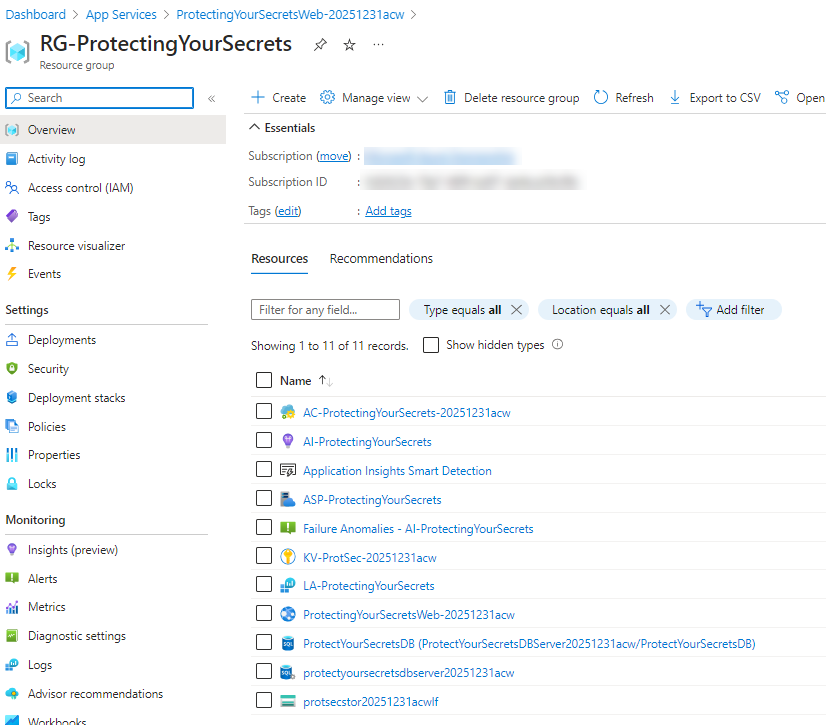

# Protecting your Secrets

This walkthrough teaches you how to manage your secrets as a developer, making sure you don't put secrets in your code, and how to use the secrets in your code.

Integrations with Azure Key Vault and Azure App Configuration allow Azure App Service (and other Azure Services) to easily interact with secrets.

Placing secrets into Azure App Configuration and KeyVault also means that your developers never need to actually know the values of the secret.

Finally, this walkthrough will show you how to enable some tools on your repositories at GitHub to make sure that you are alerted when a secret is placed into your GitHub repository.

## Prerequisites

You will need the following:

- Visual Studio Community or better (or JetBrains Rider)
- .NET SDK installed on your machine to develop .NET Core Web applications
- A GitHub Account
- An Azure Subscription
- Basic Programming knowledge
- Optional GIT command line tools (can use your IDE instead if you desire)

## Create a new GitHub repository

You will need a GitHub repository to store your solution and set up CI/CD to Azure via GitHub Actions.

Alternatively, you could right-click and publish your solution to Azure from your desktop, but this walkthrough will focus on GitHub Actions as the deployment mechanism.

## Deploy the IAC

A number of resources are needed to complete this walkthrough, and can be deployed using the templates in the `iac` folder of this repository.

Deploy the IAC using the following instructions:  

- [Connect To Azure using the Azure CLI](https://learn.microsoft.com/cli/azure/authenticate-azure-cli?WT.mc_id=AZ-MVP-5004334)  
- [Get and change (set) your Azure subscription using the Azure CLI](https://learn.microsoft.com/cli/azure/manage-azure-subscriptions-azure-cli?WT.mc_id=AZ-MVP-5004334)  
- [Create a subscription deployment using the Azure CLI](https://learn.microsoft.com/azure/azure-resource-manager/bicep/deploy-to-subscription?WT.mc_id=AZ-MVP-5004334)  

```cli
deploymentName=protecting-secrets
loc=eastus
templateFile=deployall.bicep
az deployment sub create --name $deploymentName --location $loc --template-file $templateFile
```

## Completion Check

Before moving on, ensure that you have the following resources deployed in your Azure subscription (note, if you changed some variables in the template those changes could affect some of the naming below):  

- Resource Group: RG-ProtectingYourSecrets
- Log Analytics Workspace: LA-ProtectingYourSecrets
- Application Insights: AI-ProtectingYourSecrets
- App Service Plan: ASP-ProtectingYourSecrets
- App Service: ProtectingYourSecretsWeb
- Storage Account: protsecstorYYYYMMDDxyz
    - images container
    - two images in the images container (manual upload)
- Key Vault: KV-ProtectingYourSecrets
- App Configuration: AC-ProtectingYourSecrets
- Azure SQL Server: ProtectingYourSecretsDBServer
- Azure SQL Database: ProtectingYourSecretsDB

  

## Part 1 - All the wrong things  

Begin by completing part 1 to see all the wrong things in action, and the first part of the secret management process, which includes leveraging  a third-party provider: `GitGuardian` to add alerts and notifications when a secret is published into GitHub (or other provider).

- [Part 1 - All the wrong things](Part1-AllTheWrongThings.md)  

## Part 2 - Move secrets to Azure Key Vault and `secrets.json`

Secure your secrets in your local application with `secrets.json` and at Azure by moving secrets to Azure Key vault.

- [Part 2 - Securing secrets](Part2-SecuringSecrets.md)

## Part 3 - Create shared secrets in Azure App Configuration

After getting secrets configured in Azure Key Vault, you can now use Azure App Configuration to create shared secrets that can be used across multiple applications.  This is great for things like a shared database connection, storage connections, and/or API keys.

- [Part 3 - Utilize Azure App Configuration](Part3-AzureAppConfiguration.md)

## Part 4 - Sanitize your logs

One additional important step is to sanitize your logs.  This is a simple process, but one that is often overlooked.  This step will ensure that your logs do not contain any secrets or `PII` (Personally Identifiable Information).

- [Part 4 - Sanitize your logs](Part4-SanitizeLogs.md)

## Conclusion

In this walkthrough, you learned how to protect your secrets in your code, and how to use Azure App Configuration and Azure Key Vault to store and manage your secrets, and you examined a way to ensure that secrets are not accidentally published to GitHub or your application logs.
